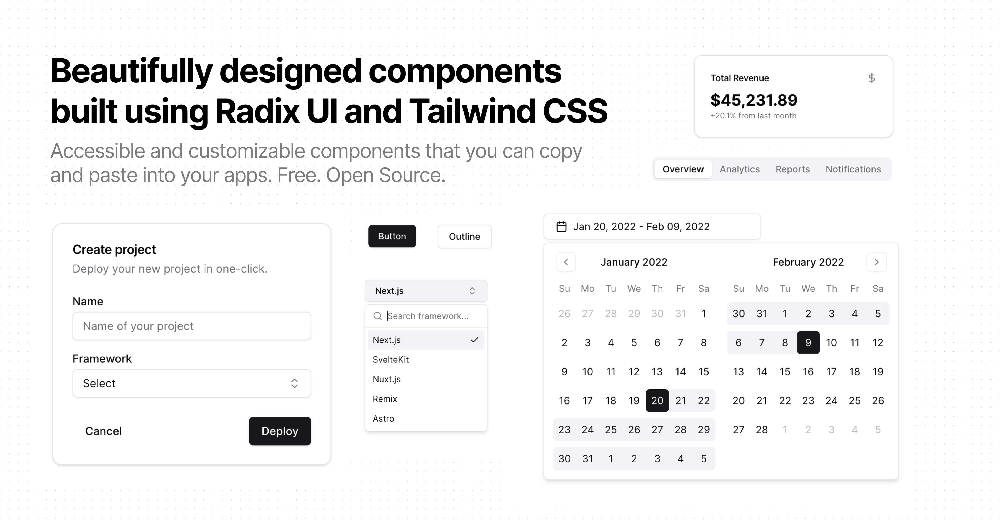

# shadcn/ui

Accessible and customizable components that you can copy and paste into your apps. Free. Open Source. **Use this to build your own component library**.



## Installation

This project uses `pnpm` as its package manager. To get started:

1. Enable corepack (if you haven't already):

   ```bash
   corepack enable
   ```

2. Prepare pnpm:

   ```bash
   corepack prepare pnpm@9.0.6 --activate
   ```

3. Install dependencies:

   ```bash
   pnpm install
   ```

4. Start the development server:
   ```bash
   pnpm run dev
   ```

> **Note**: If you see errors about the wrong package manager (e.g., yarn or npm), make sure you've completed steps 1 and 2 above.

## Documentation

Visit http://ui.shadcn.com/docs to view the documentation.

## Contributing

Please read the [contributing guide](/CONTRIBUTING.md).

## License

Licensed under the [MIT license](https://github.com/shadcn/ui/blob/main/LICENSE.md).
